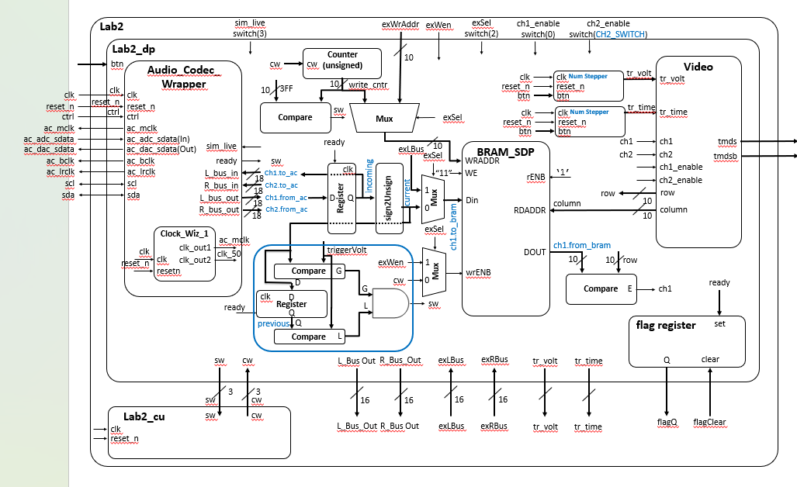
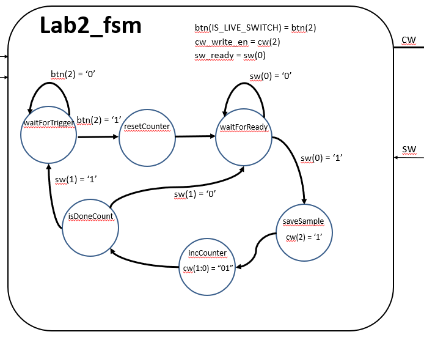

**_Introduction_**
In this lab, we integrated the video display controller developed in Lab 1 with the
audio codec on the Nexys Video board to build a basic 2-channel oscilloscope.

**_Design/ Implementation_**
As for our design the prevalent figures 1 and 2 below show the updated block diagram of the Lab2 system and the state transition diagram
of the Lab2_cu respectively. These diagrams reflect the exact signal names used in our VHDL implementation and include corrections to
the BRAM write enable path and trigger monitoring logic.

_Lab 2 Updated Block Diagram_

_Lab 2 FSM_

Insert figure 2 (Caption: Lab 2 FSM State Diagram)

As for each of the modules that we designed the following:

Working from the inside out, the Audio_Codec_Wrapper interfaces with the Audio codec and provides parallel audio samples along with a
ready signal indicating when new data is available. The signed samples are converted to unsigned format and stored for both triggering
and BRAM writing.

The trigger_detector monitors a scaled 9-bit slice of the current unsigned sample. When a positive crossing of the trigger threshold
occurs, it activates sw_trigger, signaling the control unit to begin waveform capture.

Two numeric_stepper modules control trigger voltage and trigger time. These incorporate the HW7 debouncing strategy and allow stable
adjustment of the trigger cursors in steps of 10 pixels.

The bram_addr_counter loads column 20 when commanded by the FSM and increments until column 620. When the last address is reached,
sw_last_address is set to stop capture.

The BRAM_SDP_MACRO modules store waveform samples. WREN is driven by wrENB (from the FSM), WE is held at "11" so that when WREN is
activated, both byte lanes are written. The read address is driven directly by position.col from the video module, allowing the
waveform to be drawn across the screen.

The Lab2_fsm (Control Unit) implements a mini-C style FSM with separate state transition logic and control word generation logic. It
waits for a trigger event, resets the counter to column 20, writes samples while incrementing the counter, and halts writing the samples
once the last address condition (column 620) is reached and clears write enable once sw_last_address indicates the last column. The
output control word cw drives both the BRAM address counter and the BRAM write enable signal.

The lab2 top module connects the datapath and control unit to board I/O and HDMI output.

**_Test/ Debug_**
Throughout testing and debugging for this lab, verification was primarily done through repeated synthesis and hardware implementation
rather than extensive simulation. I relied on careful signal tracing, waveform observation on the display, and thorough code
analysis to ensure each module interacted properly. Particular attention was given to confirming correct FSM transitions, BRAM write
behavior, and trigger logic alignment.

One major issue encountered was that the live signal initially appeared as a flat line and was not centered on the display. This was
traced back to overlooking the offset normalization when converting signed samples to unsigned format. Once apply_offset was properly
integrated into the trigger and waveform comparison logic, the waveform centered and displayed correctly.

Another issue involved BRAM writing not behaving as expected. By verifying the relationship between the control word, wrENB, and the
BRAM WREN signal, proper capture from column 20 to 620 was achieved.

Trigger behavior also required adjustment. Confirming that the monitored 9-bit slice and threshold scaling matched ensured correct
positive crossing detection and proper FSM operation.

Overall, debugging relied on iterative hardware testing and systematic code review until each subsystem functioned correctly as part of
the integrated design.

**_Results_**
As for our results, Gate Check 1 was achieved on time on February 15 and Gate Check 2 was achieved on February 17, both prior to their
respective due dates. These milestones were fully achieved and verified through successful hardware demonstration and waveform display
functionality.

Gate Check 3 was not achieved on time. Prior lab setup issues and minor implementation errors limited the ability to complete the final
functionality within the required timeframe, as referenced in the previous section.

However once fixed the required, B, and A level functionality was achieved once issues were resolved February 23.

All completed functionality was validated through direct hardware testing and documented using a recorded demonstration video to
provide clear evidence of system operation.
